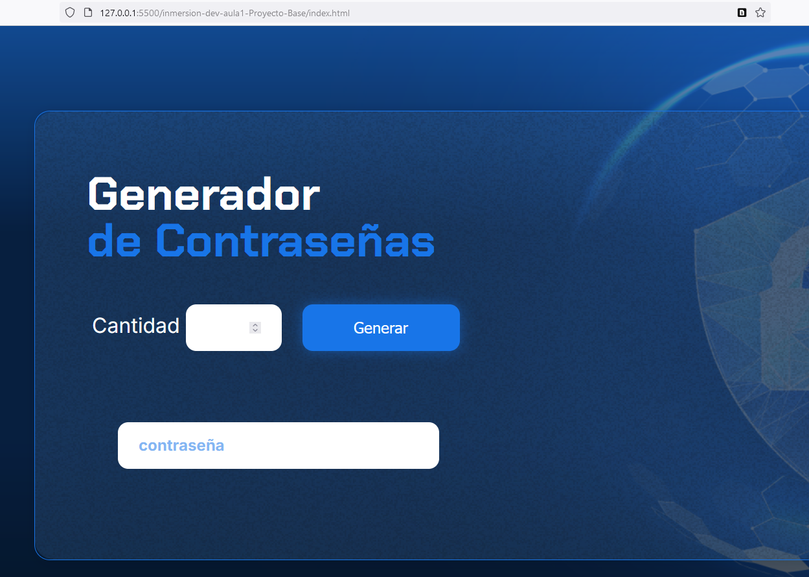
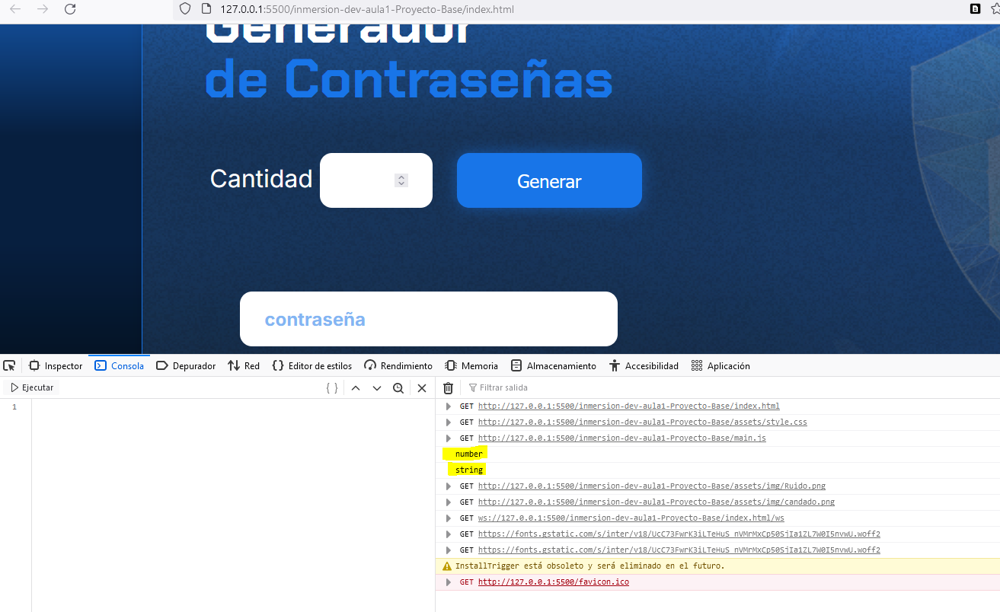

## Proyecto Generador de contraseñas

- generar una contraseñas
- que sea segura
- 

## Herramientas

- Editor visual studio code
- usar el archivo .zip disponible en recursos

## Tecnologias

1. Frontend: HTML + Javascript + CSS

- estructura disponible en los recursos

## Variables

- un nombre acorde
- usar let en vez de var

## Usando console.log()

- para probar codigo

## El objeto document

- representa la pagina web
- document.getElementById - conecta html con javascript

